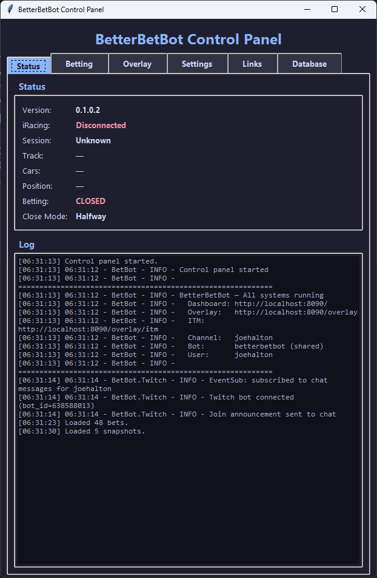
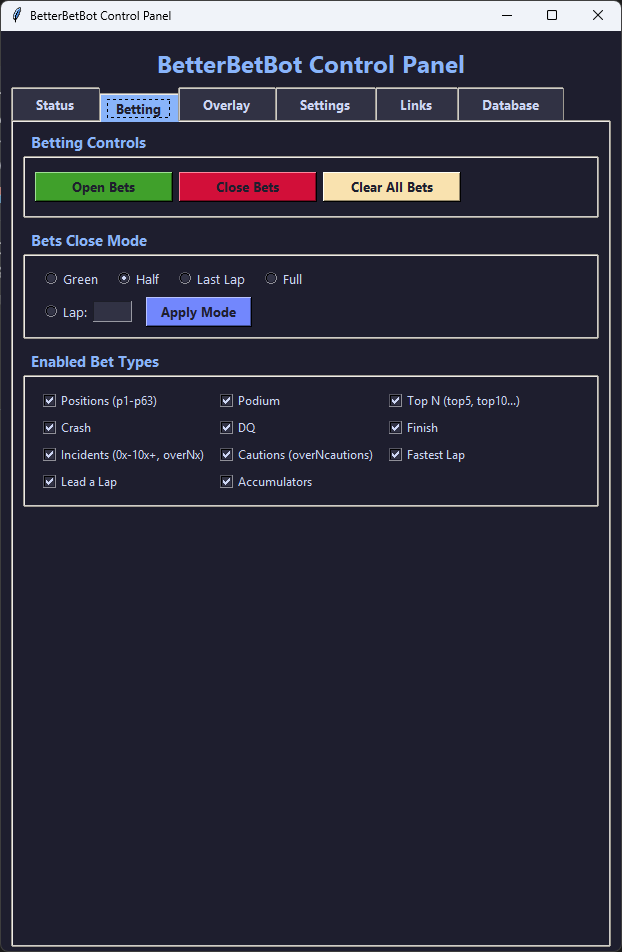
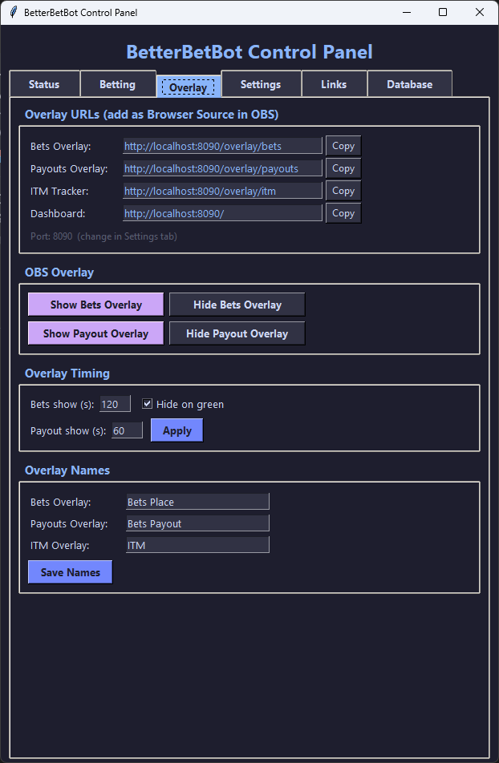
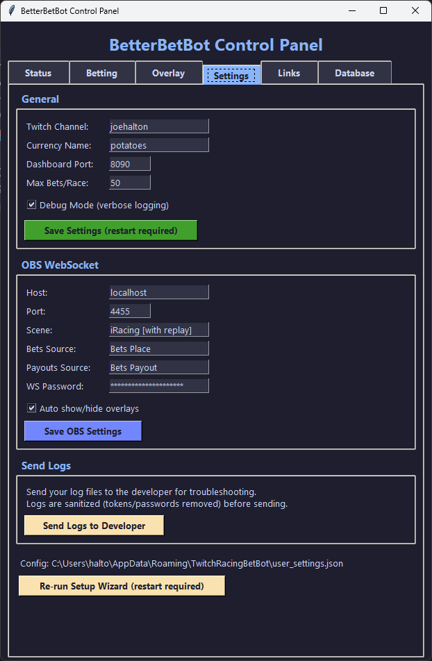
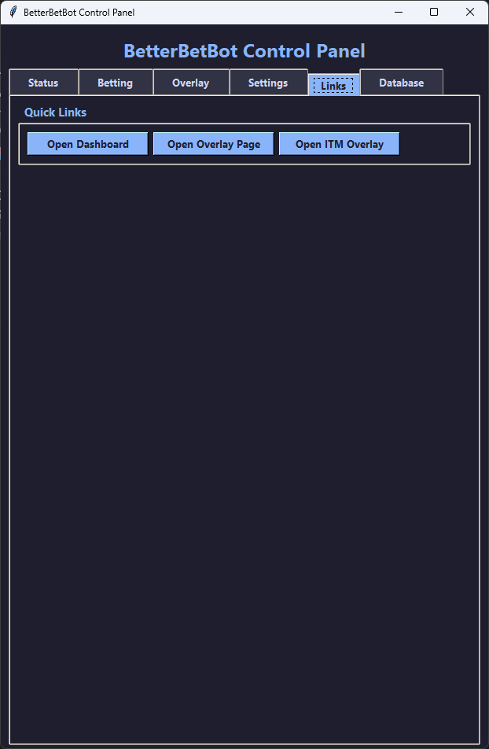
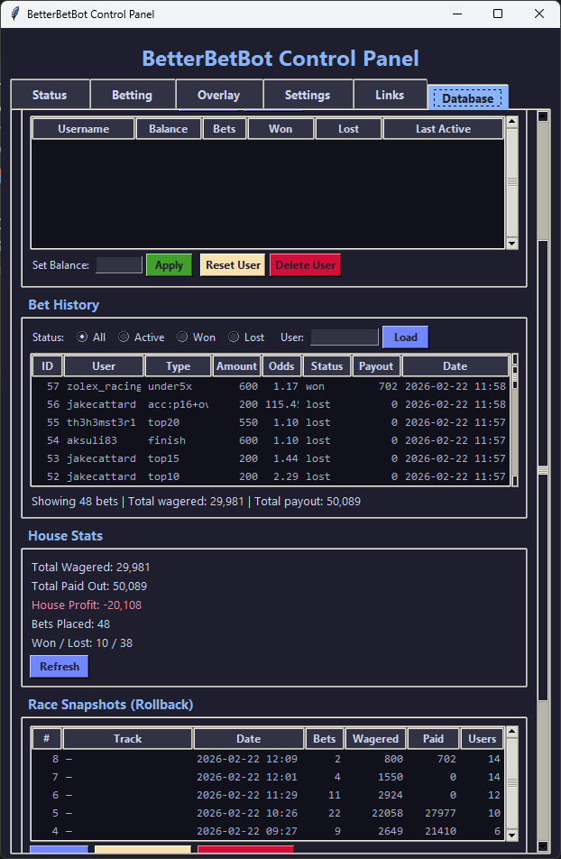

<p align="center">
  
</p>

<h1 align="center">Joe Halton's BetterBetBot</h1>

<p align="center">
  <strong>Dynamic Live iRacing Betting — Everything Changes, Every Second</strong><br>
  Experience real-time betting powered by live telemetry. Odds shift instantly as positions change, incidents happen, and race dynamics evolve. Bet on anything, any position, any outcome — the bot tracks it all in real-time.
</p>

<p align="center">
  <a href="https://www.twitch.tv/joehalton">Twitch</a> &middot;
  <a href="#installation">Installation</a> &middot;
  <a href="#getting-started">Getting Started</a> &middot;
  <a href="#dynamic-betting">Dynamic Betting</a> &middot;
  <a href="#obs-overlays">OBS Overlays</a> &middot;
  <a href="#faq">FAQ</a>
</p>

---

## 🏁 **Why BetterBetBot is Different**

**This isn't static betting.** This is a living, breathing system that reacts to every moment of the race:

- **🔴 Live Telemetry Tracking**: Every position change, incident, and crash is captured in real-time from iRacing's telemetry stream
- **⚡ Dynamic Odds**: Odds shift instantly based on live race conditions — a driver's odds change as they gain positions, incur incidents, or pull away from the pack
- **🎯 Bet on Anything**: From exact positions (P1-P63) to crash predictions, incident counts, caution flags, and complex accumulators
- **📊 Real-Time Settlement**: Bets are settled instantly as race events happen, with live win probabilities updating every second
- **🔄 Constant Evolution**: The bot continuously processes telemetry data, updating odds, probabilities, and bet statuses throughout the entire race

---

## Requirements

| Requirement | Details |
|---|---|
| **Operating System** | Windows 10 or later |
| **iRacing** | Installed and able to run (the bot reads live telemetry) |
| **Twitch Subscription** | Active subscription to [joehalton](https://www.twitch.tv/joehalton) (required for license) |
| **OBS Studio** | Optional — needed only if you want stream overlays |

No Python installation or technical setup is required. The installer handles everything.

---

## Installation

1. **Download** the latest `BetterBetBot_Setup_vX.X.X.exe` from the [Releases](https://github.com/haltonjoe-debug/BetterBetBot-Releases/releases/latest) page.
2. **Run the installer** — it will guide you through the EULA and install to `C:\Program Files\BetterBetBot`.
3. **Launch BetterBetBot** from the desktop shortcut or Start Menu.

That's it. Updates are checked automatically on each launch.

### Uninstalling

Use **Add or Remove Programs** in Windows Settings, or run the uninstaller from the Start Menu. Your settings and database are preserved in `%APPDATA%\TwitchRacingBetBot` in case you reinstall — delete that folder manually if you want a clean removal.

---

## Getting Started

### First Launch — Setup Wizard

On first launch, a setup wizard walks you through:

1. **EULA** — Read and accept the license agreement.
2. **Twitch Channel** — Enter your Twitch channel name (the channel the bot will join).
3. **Currency Name** — Choose what your virtual currency is called (default: *potatoes*).
4. **Overlay Names** — Optionally customize the display names for your OBS overlays.

### Twitch Authentication

After setup, you'll be prompted to authenticate with Twitch:

1. A window appears with a **link** and a **code**.
2. Click the link to open Twitch in your browser.
3. Enter the code and authorize.
4. The window closes automatically once complete.

This verifies your Twitch subscription and connects the shared **betterbetbot** account to your channel. You never need to create a separate bot account.

### Control Panel

Once running, the **Control Panel** window is your command center:

- **Status** — See iRacing connection, session state, and betting status at a glance.
- **Betting Controls** — Manually open/close betting, change the close mode, enable/disable bet categories.
- **Overlays** — Quick links to open your overlay URLs.
- **Settings** — Change your channel, currency, port, OBS settings, and re-run the setup wizard.

### How It Works: The Dynamic Flow

1. **You launch iRacing and join a race.**
2. BetterBetBot detects the race session automatically and begins streaming live telemetry.
3. **Betting opens** when cars are gridding (GetInCar phase) — initial odds are calculated based on iRatings and starting positions.
4. Viewers place bets in your Twitch chat using `!bet` — odds are already dynamic based on real-time factors.
5. **The race goes green** — betting closes (unless you've configured otherwise), and the real-time tracking begins.
6. **Every second matters**: As drivers change positions, incur incidents, or crash, odds and win probabilities update instantly.
7. **Live settlements**: Some bets (like crashes) settle immediately when events happen. Others wait for race completion.
8. **Final settlement**: All remaining bets are settled automatically, with payouts announced in chat.
9. **Auto-replenishment**: Zero-balance viewers are automatically replenished so everyone can keep playing.

---

## 🎰 Dynamic Betting System

### Position Bets — Track Every Position

| Type | Wins When... | Dynamic Factors |
|---|---|---|
| `p1` through `p63` | You finish in that exact position | Live position, iRating, track difficulty |
| `podium` | You finish P1, P2, or P3 | Gap to P4, current pace, incident rate |
| `top5` | You finish P1 through P5 | Position trends, lap times, traffic situations |
| `top10`, `top15`, `top20`, etc. | You finish within the top N | Race progress, caution patterns, tire strategy |

### Event Bets — Race Moment Predictions

| Type | Wins When... | Live Tracking |
|---|---|---|
| `crash` | You DNF (towed/retired) | Monitors tow events, off-track duration |
| `finish` | You finish the race (no DNF, no DQ) | Tracks completion status, disqualifications |
| `dq` | You are disqualified | Monitors black flags and DQ events |
| `fastest` | You set the fastest lap | Real-time lap time comparisons |
| `lead` | You lead at least one lap | Position tracking throughout race |

### Incident Bets — Precision Predictions

| Type | Wins When... | Dynamic Calculation |
|---|---|---|
| `0x`, `2x`, `4x`, etc. | You finish with exactly that many incident points | Live incident counting + Poisson modeling |
| `10x+` | You finish with 10 or more incident points | Incident rate tracking + driver history |
| `over4x` | You finish with more than 4 incident points | Real-time incident accumulation |
| `under4x` | You finish with fewer than 4 incident points | Current incident pace projection |

### Caution Bets — Race-Wide Dynamics

| Type | Wins When... | Live Tracking |
|---|---|---|
| `over3cautions` | More than 3 cautions during the race | Caution flag counting |
| `under5cautions` | Fewer than 5 cautions during the race | Caution frequency analysis |

### Accumulators — Multiply Your Action

Combine multiple bets for multiplied odds that shift throughout the race:

```
!bet 100 p1 under4x           # Win with clean driving
!bet 50 podium over2x         # Podium despite incidents  
!bet 75 top5 crash            # Top 5 OR crash (either way pays)
```

**Maximum 6 legs per accumulator.** All legs must win for the accumulator to pay out. Odds update in real-time as each leg's probability changes.

### Flexible Betting Amounts

```
!bet 100 p1          # Bet exact amount
!bet all crash       # Bet your entire balance
!bet min top5        # Bet minimum (20% of balance)
!bet half podium     # Bet half your balance
!bet 30% finish      # Bet 30% of your balance
```

---

## 🎮 Betting Close Modes — Control the Action

Control when betting closes during a race. Set this in the Control Panel or via the Settings tab.

| Mode | Betting Closes When... | Strategic Impact |
|---|---|---|
| **Green Flag** (default) | The race goes green | Pre-race odds only, pure prediction |
| **Halfway** | The leader reaches the halfway point | Mix of pre-race and early-race dynamics |
| **Last Lap** | The leader starts the final lap | Late-race drama, higher house edge |
| **Full Race** | Only at the checkered flag | Maximum action, highest risk/reward |

**Dynamic House Edge**: To prevent exploitation of near-certain late-race outcomes, the house edge scales from 5% (pre-race) up to 35% (race end).

---

## 💬 Chat Commands

### For Viewers

| Command | Description |
|---|---|
| `!bet <amount> <type>` | Place a bet with dynamic odds |
| `!balance` or `!bal` | Check your current balance |
| `!odds` | View current odds for common bet types |
| `!odds <type>` | View odds for a specific bet type |
| `!mybets` | See your active bets with live win probability |
| `!stats` or `!mystats` | View your lifetime betting stats |
| `!history` | See your last 5 settled bets |
| `!streak` | Check your current and best win streaks |
| `!leaderboard` or `!lb` | Top 10 currency holders |
| `!season` or `!standings` | Current season standings by profit |
| `!give <amount> <user>` | Give currency to another viewer |
| `!betstats` | Database-wide betting statistics |
| `!crashstats` | Streamer's recent crash/DNF rates |
| `!trackstats` | Stats for the current track |
| `!help` | Show available commands |
| `!ping` | Check if the bot is alive |
| `!botinfo` | Bot version, iRacing status, and betting state |
| `!iracing` or `!status` | Current iRacing session info |

### For the Broadcaster

| Command | Description |
|---|---|
| `!refund <user>` | Refund all active bets for a specific viewer |
| `!resetbalances` | Reset all viewer balances to 500 |
| `!clearbets` | Refund and clear all active bets |
| `!closemode` | Show the current betting close mode |
| `!endseason` | End the current season and start a new one |
| `!debug` | Toggle debug logging |

---

## 📺 OBS Overlays — Real-Time Visualization

BetterBetBot includes three browser-source overlays that update in real-time with live data:

### Bets Overlay — Live Action

`http://localhost:8080/overlay`

Shows active bets, current odds, and live win probabilities that update every second as the race progresses.


### Payouts Overlay — Instant Results

`http://localhost:8080/overlay?view=payouts`

Displays settlement results and winner announcements with dramatic animations as bets settle.


### ITM Overlay — "In The Money" Tracker

`http://localhost:8080/overlay/itm`

Compact ticker showing which bets are currently winning, with lock animations for guaranteed winners.


### Adding to OBS

1. In OBS, add a **Browser Source**.
2. Set the URL to one of the overlay URLs above.
3. Set width to **1920** and height to **1080** (or match your canvas).
4. Check **"Shutdown source when not visible"** to save resources.

> **Tip:** If you changed the dashboard port in Settings, replace `8080` with your custom port.

### OBS Auto-Show/Hide

BetterBetBot can automatically show and hide your overlay sources at the right times:

1. Install [obs-websocket](https://obsproject.com/forum/resources/obs-websocket-5-x-compat.1211/) (included in OBS 28+).
2. In the BetterBetBot **Settings** tab, enable **OBS Auto-Show** and enter:
   - Your OBS WebSocket password (if set).
   - The scene name containing your overlays.
   - The source names for your Bets and Payouts overlays.
3. The bot will automatically show the bets overlay when betting opens, hide it at green flag, and show the payouts overlay after settlement.

## 📊 Dashboard — Command Central

Access the web dashboard at `http://localhost:8080/` while the bot is running. It provides:

- **Real-time race status** with live telemetry data
- **Active bets** with dynamically updating odds and win probabilities
- **Leaderboard** and season standings
- **Post-race analytics** and settlement history
- **House profit/loss tracking** with detailed breakdowns


---

## 🎛️ Control Panel — Complete Control

### Status Tab
Live connection status, session info, and real-time log output.



### Betting Tab
Open/close betting, set close mode, and toggle bet categories dynamically.



### Overlay Tab
Overlay URLs for OBS, show/hide controls, timing, and custom names.



### Settings Tab
Channel, currency, port, OBS WebSocket, and log sending configuration.



### Links Tab
Quick-launch buttons for the dashboard and overlays.



### Database Tab
User management, bet history, house stats, and race snapshot rollback.



---

## 🧮 How Odds Work — The Intelligence Engine

Odds are calculated dynamically using a **Plackett-Luce probability model** that factors in multiple real-time variables:

### Pre-Race Factors
- **iRating** — Higher-rated drivers get lower odds for position bets
- **Starting Position** — Grid position influences win probability
- **Track History** — Crash rates, caution frequencies, and incident averages from past races on the same track
- **Track Difficulty** — Technical tracks get higher crash probability multipliers

### Live Race Factors
- **Current Position** — Real-time position changes update odds instantly
- **Incident Accumulation** — Current incident count affects incident bet odds
- **Race Progress** — As the race progresses, odds for certain outcomes become more certain
- **Live Telemetry** — Gap to leaders, lap times, and on-track status

### House Edge Scaling
To maintain fairness and prevent exploitation:
- **5% house edge** for pre-race bets
- **Scaling up to 35%** for late-race bets on near-certain outcomes
- **Dynamic adjustment** based on race progress and bet timing

---

## Settings and Data

All user data is stored locally on your machine:

| Item | Location |
|---|---|
| **Settings** | `%APPDATA%\TwitchRacingBetBot\user_settings.json` |
| **Database** | `%APPDATA%\TwitchRacingBetBot\betbot.db` |
| **Auth Tokens** | `%APPDATA%\TwitchRacingBetBot\auth_token.json` |
| **Logs** | `logs\` folder in the install directory |

To reset everything, delete the `%APPDATA%\TwitchRacingBetBot` folder and relaunch.

---

## ❓ FAQ

**Q: How dynamic are the odds really?**
Extremely dynamic. Odds update every 50ms (20Hz) during races based on live telemetry. A driver's odds can change multiple times per lap as they gain positions, incur incidents, or as race conditions evolve.

**Q: Can I really bet on anything?**
Almost anything! You can bet on exact positions (P1-P63), position ranges, crashes, incidents, cautions, fastest laps, leading laps, and complex combinations. The system tracks over 100 different possible outcomes.

**Q: Do my viewers need to install anything?**
No. Viewers interact entirely through Twitch chat commands. Nothing to download.

**Q: Is the currency real money?**
No. It is virtual currency for entertainment only. No real money is involved.

**Q: What happens if iRacing disconnects mid-race?**
If you disconnect during a race, position bets are settled as DNF and crash bets pay out. If you disconnect before the race starts, all bets are refunded.

**Q: What happens if a viewer runs out of currency?**
After each race, viewers with zero balance are automatically replenished with 500 currency. There is also a small login bonus each session.

**Q: Can I change the currency name after setup?**
Yes. Use the **Settings** tab in the Control Panel to change it at any time.

**Q: Can I run this without OBS overlays?**
Absolutely. The overlays are optional. The bot works entirely through Twitch chat.

**Q: Does this work with hosted races and leagues?**
Yes. BetterBetBot works with any iRacing session that has a race, including official races, hosted sessions, and leagues.

**Q: Why does it say "Subscription Required"?**
You need an active Twitch subscription to [joehalton](https://www.twitch.tv/joehalton) to use BetterBetBot. Subscribe and restart the app.

**Q: Can multiple streamers use this at the same time?**
Yes. Each streamer runs their own instance with their own database. The shared bot account handles all channels.

**Q: How do updates work?**
BetterBetBot checks for updates automatically on each launch. If a new version is available, you'll be prompted to download and install it.

---

## Troubleshooting

| Problem | Solution |
|---|---|
| "Another instance already running" | Close any existing BetterBetBot windows, or check Task Manager for `BetterBetBot.exe`. |
| Bot not responding in chat | Check that your channel name is correct in Settings. Restart the app. |
| iRacing shows "Disconnected" | Make sure iRacing is running and you are in a session. The bot connects automatically. |
| Overlays show blank | Verify the URL and port match your settings. Try `http://localhost:8080/overlay` in a browser first. |
| "Failed to obtain bot token" | Check your internet connection. If the problem persists, delete `%APPDATA%\TwitchRacingBetBot\bot_token.json` and restart. |
| Betting doesn't open | Betting only opens during **race sessions** (not practice or qualifying). Wait for the race grid phase. |
| Odds seem wrong | Odds are calculated dynamically based on multiple factors. Check track history, driver iRatings, and current race conditions. |

### Send Logs to Developer

If you run into an issue you can't resolve, send your log files directly to the developer:

1. Open BetterBetBot → **Settings** tab → click **"Send Logs to Developer"**.
2. Logs are automatically sanitized (tokens, passwords, and secrets are removed) before uploading.

No setup required — works out of the box.

---

## License

BetterBetBot is licensed software. Use requires an active Twitch subscription to [joehalton](https://www.twitch.tv/joehalton). See the [EULA](assets/LICENSE_EULA.txt) for full terms.

---

<p align="center">
  <strong>Experience the future of iRacing betting — where every second counts and everything changes.</strong><br>
  Built by <a href="https://www.twitch.tv/joehalton">Joe Halton</a>
</p>
