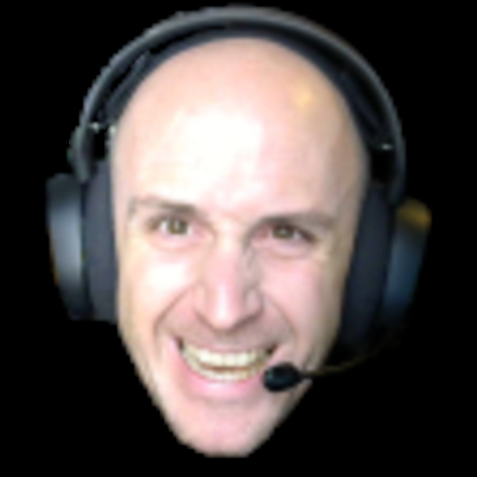
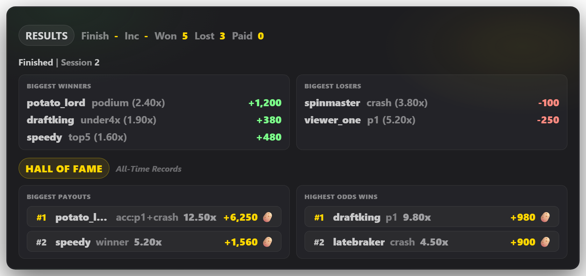
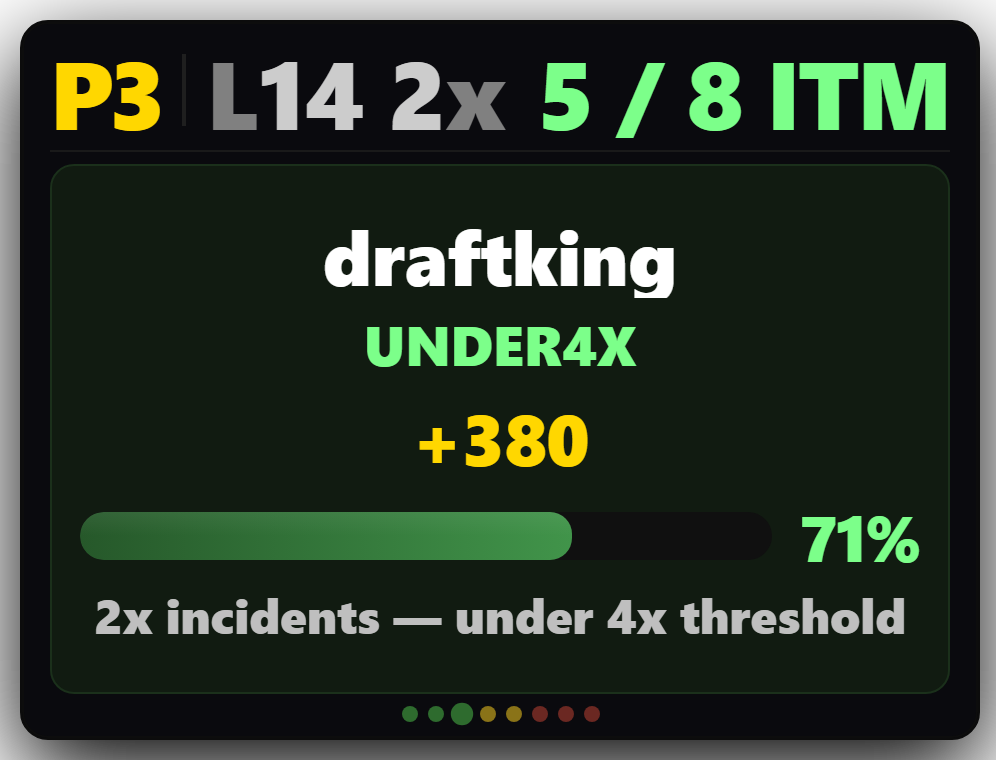
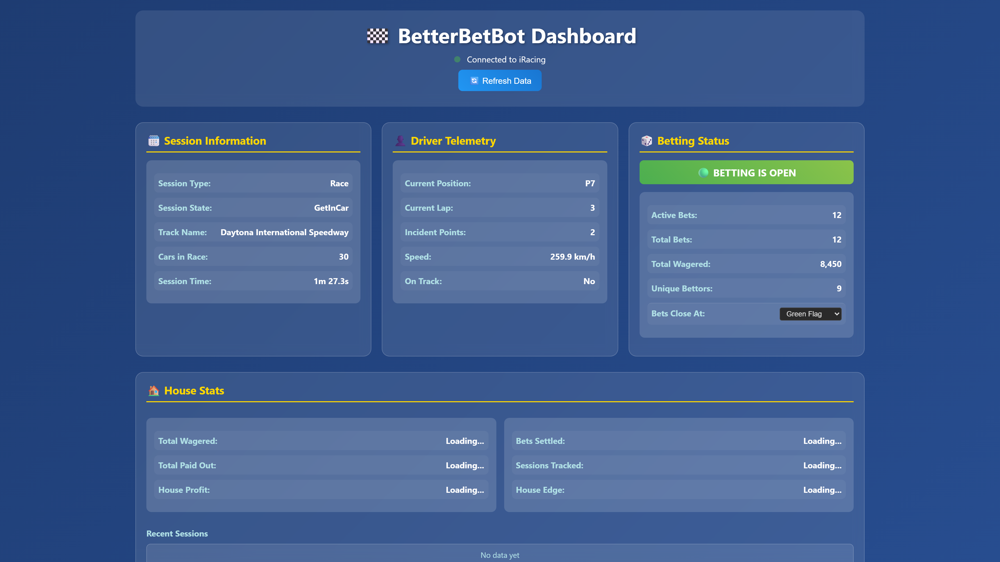

<p align="center">
  
</p>

<h1 align="center">Joe Halton's BetterBetBot</h1>

<p align="center">
  <strong>Live iRacing betting for your Twitch chat</strong><br>
  Viewers bet virtual currency on race outcomes — positions, crashes, incidents, and more — with dynamic odds powered by real-time telemetry.
</p>

<p align="center">
  <a href="https://www.twitch.tv/joehalton">Twitch</a> &middot;
  <a href="#installation">Installation</a> &middot;
  <a href="#getting-started">Getting Started</a> &middot;
  <a href="#chat-commands">Chat Commands</a> &middot;
  <a href="#obs-overlays">OBS Overlays</a> &middot;
  <a href="#faq">FAQ</a>
</p>

---

## Requirements

| Requirement | Details |
|---|---|
| **Operating System** | Windows 10 or later |
| **iRacing** | Installed and able to run (the bot reads live telemetry) |
| **Twitch Subscription** | Active subscription to [joehalton](https://www.twitch.tv/joehalton) (required for license) |
| **OBS Studio** | Optional — needed only if you want stream overlays |

No Python installation or technical setup is required. The installer handles everything.

---

## Installation

1. **Download** the latest `BetterBetBot_Setup_vX.X.X.exe` from the [Releases](https://github.com/haltonjoe-debug/BetterBetBot-Releases/releases/latest) page.
2. **Run the installer** — it will guide you through the EULA and install to `C:\Program Files\BetterBetBot`.
3. **Launch BetterBetBot** from the desktop shortcut or Start Menu.

That's it. Updates are checked automatically on each launch.

### Uninstalling

Use **Add or Remove Programs** in Windows Settings, or run the uninstaller from the Start Menu. Your settings and database are preserved in `%APPDATA%\TwitchRacingBetBot` in case you reinstall — delete that folder manually if you want a clean removal.

---

## Getting Started

### First Launch — Setup Wizard

On first launch, a setup wizard walks you through:

1. **EULA** — Read and accept the license agreement.
2. **Twitch Channel** — Enter your Twitch channel name (the channel the bot will join).
3. **Currency Name** — Choose what your virtual currency is called (default: *potatoes*).
4. **Overlay Names** — Optionally customize the display names for your OBS overlays.

### Twitch Authentication

After setup, you'll be prompted to authenticate with Twitch:

1. A window appears with a **link** and a **code**.
2. Click the link to open Twitch in your browser.
3. Enter the code and authorize.
4. The window closes automatically once complete.

This verifies your Twitch subscription and connects the shared **betterbetbot** account to your channel. You never need to create a separate bot account.

### Control Panel

Once running, the **Control Panel** window is your command center:

- **Status** — See iRacing connection, session state, and betting status at a glance.
- **Betting Controls** — Manually open/close betting, change the close mode, enable/disable bet categories.
- **Overlays** — Quick links to open your overlay URLs.
- **Settings** — Change your channel, currency, port, OBS settings, and re-run the setup wizard.

### How It Works

1. **You launch iRacing and join a race.**
2. BetterBetBot detects the race session automatically.
3. **Betting opens** when cars are gridding (GetInCar phase).
4. Viewers place bets in your Twitch chat using `!bet`.
5. **Betting closes** at the green flag (or at a point you configure).
6. The race runs — the bot tracks positions, incidents, crashes, and cautions in real time.
7. **Bets are settled** automatically when the race finishes, and payouts are announced in chat.
8. Zero-balance viewers are automatically replenished so everyone can keep playing.

---

## Chat Commands

### For Viewers

| Command | Description |
|---|---|
| `!bet <amount> <type>` | Place a bet. Amount can be a number, `all`, `min`, `half`, or a percentage like `30%`. |
| `!balance` or `!bal` | Check your current balance. |
| `!odds` | View odds for common bet types. |
| `!odds <type>` | View odds for a specific bet type (e.g. `!odds crash`). |
| `!mybets` | See your active bets with live win probability. |
| `!stats` or `!mystats` | View your lifetime betting stats. |
| `!history` | See your last 5 settled bets. |
| `!streak` | Check your current and best win streaks. |
| `!leaderboard` or `!lb` | Top 10 currency holders. |
| `!season` or `!standings` | Current season standings by profit. |
| `!give <amount> <user>` | Give currency to another viewer. |
| `!betstats` | Database-wide betting statistics. |
| `!crashstats` | Streamer's recent crash/DNF rates. |
| `!trackstats` | Stats for the current track. |
| `!help` | Show available commands. |
| `!ping` | Check if the bot is alive. |
| `!botinfo` | Bot version, iRacing status, and betting state. |
| `!iracing` or `!status` | Current iRacing session info. |

### For the Broadcaster

| Command | Description |
|---|---|
| `!refund <user>` | Refund all active bets for a specific viewer. |
| `!resetbalances` | Reset all viewer balances to 500. |
| `!clearbets` | Refund and clear all active bets. |
| `!closemode` | Show the current betting close mode. |
| `!endseason` | End the current season and start a new one. |
| `!debug` | Toggle debug logging. |

---

## Bet Types

### Position Bets

| Type | Wins When... |
|---|---|
| `p1` through `p63` | You finish in that exact position. |
| `podium` | You finish P1, P2, or P3. |
| `top5` | You finish P1 through P5. |
| `top10` | You finish P1 through P10. |
| `top15`, `top20`, etc. | You finish within the top N. |

### Event Bets

| Type | Wins When... |
|---|---|
| `crash` | You DNF (towed/retired). |
| `finish` | You finish the race (no DNF, no DQ). |
| `dq` | You are disqualified. |
| `fastest` | You set the fastest lap. |
| `lead` | You lead at least one lap. |

### Incident Bets

| Type | Wins When... |
|---|---|
| `0x`, `2x`, `4x`, etc. | You finish with exactly that many incident points. |
| `10x+` | You finish with 10 or more incident points. |
| `over4x` | You finish with more than 4 incident points. |
| `under4x` | You finish with fewer than 4 incident points. |

### Caution Bets

| Type | Wins When... |
|---|---|
| `over3cautions` | More than 3 cautions during the race. |
| `under5cautions` | Fewer than 5 cautions during the race. |

### Accumulators

Combine multiple bets for multiplied odds:

```
!bet 100 p1 under4x
!bet 50 podium under2x
```

All legs must win for the accumulator to pay out. Maximum 6 legs.

### Betting Examples

```
!bet 100 p1          Bet 100 on winning
!bet all crash       Bet your entire balance on a crash
!bet min top5        Bet the minimum (20% of balance) on top 5
!bet half podium     Bet half your balance on a podium finish
!bet 30% finish      Bet 30% of your balance on finishing
```

---

## Betting Close Modes

Control when betting closes during a race. Set this in the Control Panel or via the Settings tab.

| Mode | Betting Closes When... |
|---|---|
| **Green Flag** (default) | The race goes green. |
| **Halfway** | The leader reaches the halfway point. |
| **Last Lap** | The leader starts the final lap. |
| **Full Race** | Only at the checkered flag (bets open the entire race). |

For timed races, Halfway and Last Lap use elapsed time instead of laps.

---

## OBS Overlays

BetterBetBot includes three browser-source overlays for OBS:

### Bets Overlay

`http://localhost:8080/overlay`

Shows active bets, odds, and live win probabilities during the race.


### Payouts Overlay

`http://localhost:8080/overlay?view=payouts`

Displays settlement results and winner announcements after the race.



### ITM Overlay

`http://localhost:8080/overlay/itm`

Compact "In The Money" ticker showing which bets are currently winning.



### Adding to OBS

1. In OBS, add a **Browser Source**.
2. Set the URL to one of the overlay URLs above.
3. Set width to **1920** and height to **1080** (or match your canvas).
4. Check **"Shutdown source when not visible"** to save resources.

> **Tip:** If you changed the dashboard port in Settings, replace `8080` with your custom port.

### OBS Auto-Show/Hide

BetterBetBot can automatically show and hide your overlay sources at the right times:

1. Install [obs-websocket](https://obsproject.com/forum/resources/obs-websocket-5-x-compat.1211/) (included in OBS 28+).
2. In the BetterBetBot **Settings** tab, enable **OBS Auto-Show** and enter:
   - Your OBS WebSocket password (if set).
   - The scene name containing your overlays.
   - The source names for your Bets and Payouts overlays.
3. The bot will automatically show the bets overlay when betting opens, hide it at green flag, and show the payouts overlay after settlement.

---

## Dashboard

Access the web dashboard at `http://localhost:8080/` while the bot is running. It provides:

- Real-time race and betting status
- Active bets with live odds
- Leaderboard and season standings
- Post-race analytics and settlement history
- House profit/loss tracking



---

## Control Panel


---

## How Odds Work

Odds are calculated dynamically using a **Plackett-Luce probability model** that factors in:

- **iRating** — Higher-rated drivers get lower odds for position bets.
- **Starting Position** — Grid position influences win probability.
- **Track History** — Crash rates, caution frequencies, and incident averages from past races on the same track.
- **Live Telemetry** — During the race, odds adjust based on current position, incidents, and race progress.
- **House Edge** — A small 5% edge on pre-race bets, scaling up to 35% for late in-race bets to prevent exploitation.

---

## Settings and Data

All user data is stored locally on your machine:

| Item | Location |
|---|---|
| **Settings** | `%APPDATA%\TwitchRacingBetBot\user_settings.json` |
| **Database** | `%APPDATA%\TwitchRacingBetBot\betbot.db` |
| **Auth Tokens** | `%APPDATA%\TwitchRacingBetBot\auth_token.json` |
| **Logs** | `logs\` folder in the install directory |

To reset everything, delete the `%APPDATA%\TwitchRacingBetBot` folder and relaunch.

---

## FAQ

**Q: Do my viewers need to install anything?**
No. Viewers interact entirely through Twitch chat commands. Nothing to download.

**Q: Is the currency real money?**
No. It is virtual currency for entertainment only. No real money is involved.

**Q: What happens if iRacing disconnects mid-race?**
If you disconnect during a race, position bets are settled as DNF and crash bets pay out. If you disconnect before the race starts, all bets are refunded.

**Q: What happens if a viewer runs out of currency?**
After each race, viewers with zero balance are automatically replenished with 500 currency. There is also a small login bonus each session.

**Q: Can I change the currency name after setup?**
Yes. Use the **Settings** tab in the Control Panel to change it at any time.

**Q: Can I run this without OBS overlays?**
Absolutely. The overlays are optional. The bot works entirely through Twitch chat.

**Q: Does this work with hosted races and leagues?**
Yes. BetterBetBot works with any iRacing session that has a race, including official races, hosted sessions, and leagues.

**Q: Why does it say "Subscription Required"?**
You need an active Twitch subscription to [joehalton](https://www.twitch.tv/joehalton) to use BetterBetBot. Subscribe and restart the app.

**Q: Can multiple streamers use this at the same time?**
Yes. Each streamer runs their own instance with their own database. The shared bot account handles all channels.

**Q: How do updates work?**
BetterBetBot checks for updates automatically on each launch. If a new version is available, you'll be prompted to download and install it.

---

## Troubleshooting

| Problem | Solution |
|---|---|
| "Another instance already running" | Close any existing BetterBetBot windows, or check Task Manager for `BetterBetBot.exe`. |
| Bot not responding in chat | Check that your channel name is correct in Settings. Restart the app. |
| iRacing shows "Disconnected" | Make sure iRacing is running and you are in a session. The bot connects automatically. |
| Overlays show blank | Verify the URL and port match your settings. Try `http://localhost:8080/overlay` in a browser first. |
| "Failed to obtain bot token" | Check your internet connection. If the problem persists, delete `%APPDATA%\TwitchRacingBetBot\bot_token.json` and restart. |
| Betting doesn't open | Betting only opens during **race sessions** (not practice or qualifying). Wait for the race grid phase. |

### Send Logs to Developer

If you run into an issue you can't resolve, send your log files directly to the developer:

1. Open BetterBetBot → **Settings** tab → click **"Send Logs to Developer"**.
2. Logs are automatically sanitized (tokens, passwords, and secrets are removed) before uploading.

No setup required — works out of the box.

---

## License

BetterBetBot is licensed software. Use requires an active Twitch subscription to [joehalton](https://www.twitch.tv/joehalton). See the [EULA](assets/LICENSE_EULA.txt) for full terms.

---

<p align="center">
  Built by <a href="https://www.twitch.tv/joehalton">Joe Halton</a>
</p>
